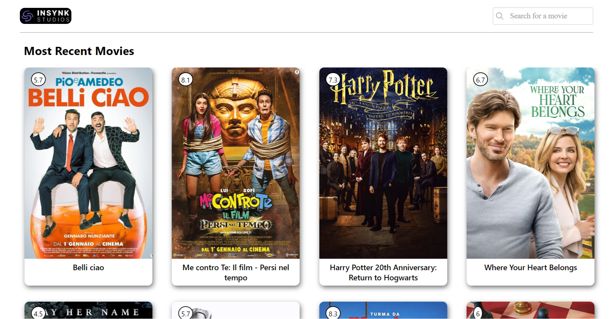

<h1 align="center">Welcome to React Based Movie App 👋</h1>
<p align="center">
  <a href="https://github.com/Satellite-system/React-Node-Based-Movie-App">
    
  </a>

  <h3 align="center">Movie App</h3>

  <p align="center">
    A React Based Movie Website!
    <br/>
    Note This Movie Website's Design has been taken from Insynk Studios'.
    <br/>
    <br/>
    <a href="https://zakka-movie-app.netlify.app/"><strong>Visit Here »</strong></a>
    <br/>
    <br/>
    <a href="https://github.com/Satellite-system/React-Node-Based-Movie-App/blob/master/README.md">Explore the docs</a>
    .
    <a href="https://github.com/Satellite-system/React-Node-Based-Movie-App/issues">Report Bug</a>
    .
    <a href="https://github.com/Satellite-system/React-Node-Based-Movie-App/issues">Request Feature</a>
  </p>
</p>


 
 
  

## Table Of Contents

- [Table Of Contents](#table-of-contents)
- [About The Project](#about-the-project)
- [Sections](#sections)
- [Built With](#built-with)
- [Getting Started](#getting-started)
  - [Prerequisites](#prerequisites)
  - [Installation](#installation)
- [Roadmap](#roadmap)
- [Contributing](#contributing)
  - [Creating A Pull Request](#creating-a-pull-request)
- [Available Scripts](#available-scripts)
  - [`yarn start`](#yarn-start)
  - [`yarn test`](#yarn-test)
  - [`yarn build`](#yarn-build)
  - [`yarn eject`](#yarn-eject)
- [Acknowledgements](#acknowledgements)

## About The Project




This a React Based Movie Website.In this website it has most recently released movies in its home page. It also has a functionality to search new movies by the keyword entered on the search bar.

In this project <strong href="https://developers.themoviedb.org/3/getting-started/introduction">The Movie Database Api</strong> has been used.

Followings are some key Features of this websote:

* Most recently released movie on Home page.
* Search Movie with the Keywords
* Responsive Design :smile:

Feel free to suggest changes by opening a new issue, or if you want to implement your own, feel free to fork this repo and create a pull request.

## Sections
* [Summary and About me]()
* [Education]()
* [Skills]()
* [Work Experience]()
* [Projects]()
* [Feedbacks]()
* [Contact]()

## Built With

* [JavaScript](https://www.javascript.com/)
* [Css](https://vuejs.org/)
* [Movie DB API](https://developers.themoviedb.org/3/getting-started/introduction)

## Getting Started

This is a Movie Website.

### Prerequisites

This program has no pre-requisites

### Installation

1. Clone the repo

```sh
git clone https://github.com/Satellite-system/React-Node-Based-Movie-App.git
```

2. Open The src Folder

3. Edit as per your Requirements
4. Have fun!


## Roadmap

See the [open issues](https://github.com/Satellite-system/React-Node-Based-Movie-App/issues) for a list of proposed features (and known issues).

## Contributing

Contributions are what make the open source community such an amazing place to be learn, inspire, and create. Any contributions you make are **greatly appreciated**.
* If you have suggestions for adding or removing projects, feel free to [open an issue](https://github.com/Satellite-system/React-Node-Based-Movie-App/issues/new) to discuss it, or directly create a pull request after you edit the *README.md* file with necessary changes.
* Please make sure you check your spelling and grammar.
* Create individual PR for each suggestion.
* Please also read through the [Code Of Conduct](https://github.com/Satellite-system/React-Node-Based-Movie-App/blob/main/CODE_OF_CONDUCT.md) before posting your first idea as well.

### Creating A Pull Request

1. Fork the Project
2. Create your Feature Branch (`git checkout -b feature/AmazingFeature`)
3. Commit your Changes (`git commit -m 'Add some AmazingFeature'`)
4. Push to the Branch (`git push origin feature/AmazingFeature`)
5. Open a Pull Request

This project was bootstrapped with [Create React App](https://github.com/facebook/create-react-app).

## Available Scripts

In the project directory, you can run:

### `yarn start`

Runs the app in the development mode.\
Open [http://localhost:3000](http://localhost:3000) to view it in your browser.

The page will reload when you make changes.\
You may also see any lint errors in the console.

### `yarn test`

Launches the test runner in the interactive watch mode.\
See the section about [running tests](https://facebook.github.io/create-react-app/docs/running-tests) for more information.

### `yarn build`

Builds the app for production to the `build` folder.\
It correctly bundles React in production mode and optimizes the build for the best performance.

The build is minified and the filenames include the hashes.\
Your app is ready to be deployed!

See the section about [deployment](https://facebook.github.io/create-react-app/docs/deployment) for more information.

### `yarn eject`

**Note: this is a one-way operation. Once you `eject`, you can't go back!**

If you aren't satisfied with the build tool and configuration choices, you can `eject` at any time. This command will remove the single build dependency from your project.

Instead, it will copy all the configuration files and the transitive dependencies (webpack, Babel, ESLint, etc) right into your project so you have full control over them. All of the commands except `eject` will still work, but they will point to the copied scripts so you can tweak them. At this point you're on your own.

You don't have to ever use `eject`. The curated feature set is suitable for small and middle deployments, and you shouldn't feel obligated to use this feature. However we understand that this tool wouldn't be useful if you couldn't customize it when you are ready for it.

## Acknowledgements

* [ShaanCoding](https://github.com/ShaanCoding/ReadME-Generator/tree/main#table-of-contents)
* [ImgShields](https://shields.io/)